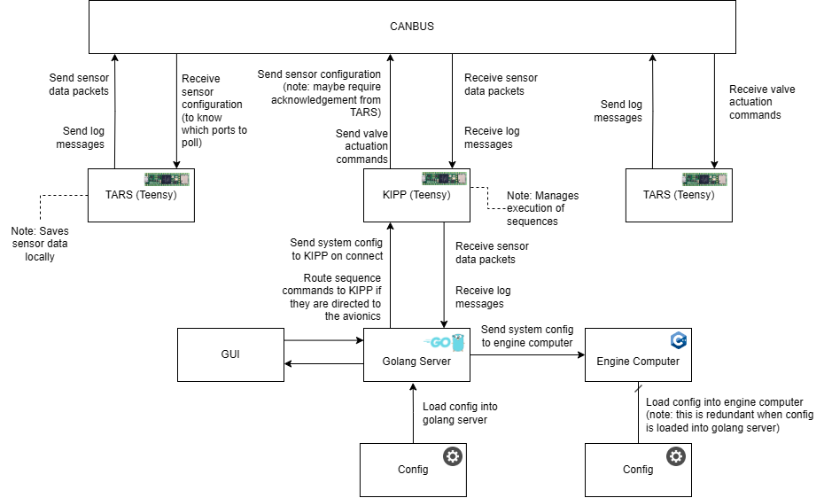

# One DayGlow to Rule Them All

Monorepo for the Metropolitan Aerospace Combustion Hub software team, focusing on combining code and readable documentation inline for future members.

# New GUI


The [gui new](/mach-gui/) is our new frontend interface that will connects to the go server and allows anybody to open up their device and view the state of the rocket. 

We will be using the [React.js](https://react.dev/reference/react) framework, using [Typescript](https://www.typescriptlang.org/) (the hope is that using types within our functions will make the GUI more maintainable). It also uses using [Vite](https://vite.dev/) as its build tool (and for hot module replacement).

## New GUI - Development

### Building and Debugging

If this is your first time setting up the project, make sure you have Node.js installed. You can [download it here](https://nodejs.org/en/download/package-manager).

Now, make sure you are in the correct directory for the new GUI (mach-gui),
### `cd mach-gui`


Next, install all dependencies with:
### `npm i`

To run the server, simply type:

### `npm run dev`

This will run the app in the development mode. Open [http://localhost:5173/](http://localhost:5173/) to view it in the browser.

The page will reload if you make edits. You will also see any lint errors in the console.

### Contribution

For every feature that you work on, you must make your own branch. We recommend using the format `name-feature`.
You can do this by branching off the main branch. For example, if your name is Charel, and you are working on a "Hello World" feature, you can create a branch as follows:

    git checkout main
    git pull
    git checkout -b charel-helloworld

Once you are done developing the feature, push your changes to the repository, and create a pull request to the main branch.

# Avionics (Teensy)

## Technical Outline


# Engine Computer


[Engine computer](engine-computer/src) is the software component written in [C++](https://en.cppreference.com/w/) that controls the LabJack devices used on our ground support equipment (GSE).

Currently, the rocket config in folder [config](config/) is parsed and executed by engine-computer (see [config_parser](engine-computer/src/config_parser.cpp)), making it the main control software in the system (at least until Dayglo).

# Go Server


The [go server](go/src) is our software component written in [Golang](https://go.dev/doc/) that currently acts as an interface between the GUI and engine-computer. It's really easy to make cross-platform programs in Go (unlike C++), so the purpose of this component is to be able to move some complexity away from the C++ code.

Additionally, one of the requirements for our new system design is the ability to control and aquire sensor data from both the GSE and rocket at the same time. Therefore the go server will also interface between the GUI and the avionics software.

Another cool feature of the go server is that it allows multiple clients to be connected at the same time (by broadcasting sensor data to all clients). This helps keep our engine-computer simple as it only needs to accept one connection (the go server).

# GUI


The [gui](/gui/main.py) is the frontend interface that connects to the go server and allows easy control of the rocket. 

Using the [tkinter framework](https://docs.python.org/3/library/tkinter.html), it consists of a single file with buttons to open or close any valve configured on the system, along with bars to display sensor readings like pressure transmitter or thermocouple readings.


# File Structure
```
monorepo/
├── CMakeLists.txt
├── engine-computer/
│   ├── CMakeLists.txt
│   ├── readme
│   └── src/
│       └── ...
├── go/
│   ├── CMakeLists.txt
│   ├── readme
│   └── src/
│       └── ...
├── proto/
│   ├── CMakeLists.txt
│   ├── readme
│   └── src/
│       └── ...
├── ...
└── docs/
    ├── readme
    ├── pdfs/
    │   └── ...
    ├── installation/
    │   └── ...
    └── code/
        └── ...
```
